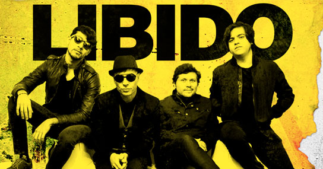
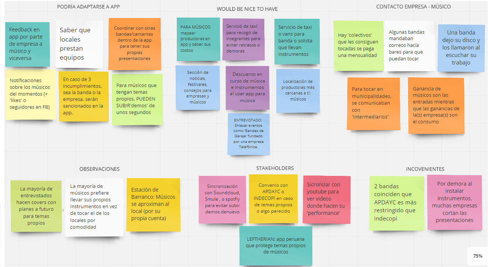
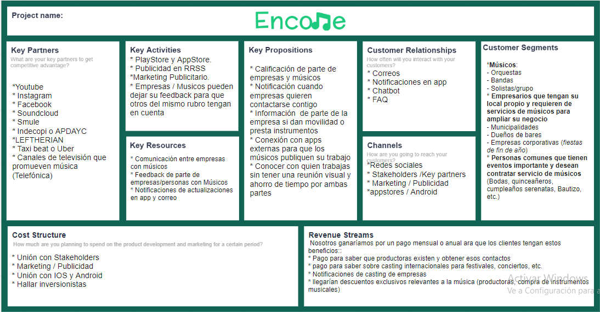
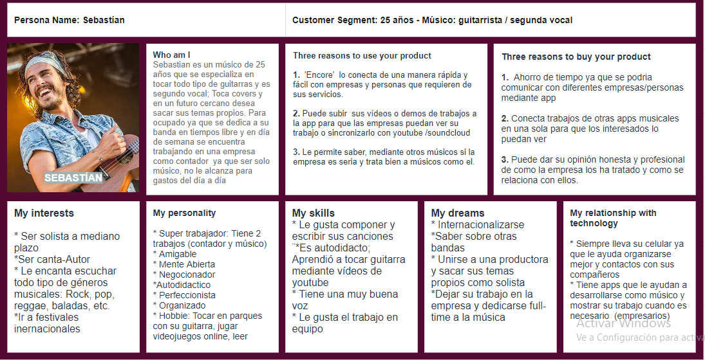
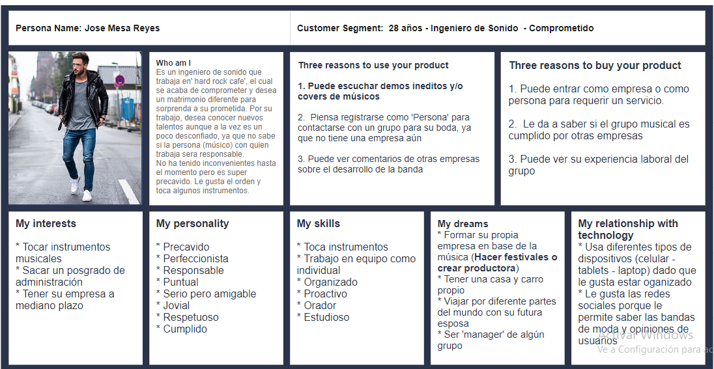

# 

Encore es una aplicación en donde músicos y empresas que requieran de sus servicio se pueden comunicar y negociar de una manera sencilla, simple y eficaz para que ambos puedan incrementar sus ingresos. No solo eso! En caso que un usuario no-empresario deseara obtener músico(s) para un evento especial, esta es la plataforma!

## Reto:

El reto a sido creado por la empresa __Laboratoria__ en donde tuvimos que poner en práctica nuestros conocimientos adquiridos en UX tales como:

- UX Research
- Interviews
- Affinity map
- Canvas de Modelo de Negocio
- User personas
- User testing
- Paper protyping
- Digital Prototyping:
  - Figma
  - Marvel

## User Research

Para el proceso de investigación de nuestro producto se ha realizado una exhaustiva busqueda en los siguientes campos:

**Research Cuantitativo**

En Perú no es un misterio que la taza de empleabilidad para los musicos no es muy alta a comparación de otros paises como: EE.UU, Asía, y Europa. Para esto se ha realizado una busqueda de articulos en internet que habla de la situación mundial y nacional relativos a la músico:

**Tecnología y la música**

  - Al pasar del tiempo, los músicos se las han arreglado para que su música se escuche y sea conocida a través del mundo pero gracias a las redes sociales
esto a cambiado; Youtube, twitter, amazon, spotify y muchos otras empresas digitales han ayudado a cantantes de esta época a ser más conocidos. A consecuencia
de ello exigen que sus artistas favoritos esten actualizados con la era digital y partir de esta demanda a salido más aplicaciones digitales relacionados con 
la música. Esto no solo beneficia ya a lo artistas conoocidos mundilmente, sino a las músicos desconocidos que sueñan con tener la oportunidad de resaltar
y mostrar su talento.

- Aunque la música ha incrementado excepcionalmente desde el comienzo de la era digítal a nivel mundial, aún así falta mucho para llegar a ser una potencia 
de ingresos para los músicos

  - "Las ventas mundiales de música en línea y en soporte físico aumentaron 3.2% en el 2015 con respecto al 2014 para alcanzar los US$ 15,000 millones"
  - "Según la IFPI, 68 millones de personas en todo el mundo se han suscrito a algún servicio de música en línea, frente a los 8 millones que lo habían 
hecho en 2010"
  - "Los beneficios del streaming aumentaron 45.2% el año 2015y prácticamente consiguieron igualarse a las ventas provenientes de las descargas 
digitales en iTunes y otros sitios que no son de escucha en línea."
  - Japón, el mayor mercado después de Estados Unidos, vio crecer sus ventas 3% luego de varios años de fuertes caídas, gracias en parte a la 
introducción del streaming, incluyendo Apple Music"
  - "Latinoamérica es la región de mayor crecimiento, con ingresos que saltaron 11,8% gracias a la popularidad de la música por streaming."
  - " las ventas de música en China, tuvieron ingresos de casi 64%"

**Fuentes:**

[PDF: Cómo vivir de la música](http://www.wipo.int/edocs/pubdocs/es/wipo_pub_939.pdf)

[Diario 'La Gestión' - El streaming da a la industria musical su primer crecimiento en 20 años](https://gestion.pe/tecnologia/streaming-da-industria-musical-primer-crecimiento-20-anos-116987)

**Celebridades/Músicos peruanos se hacen escuchar**

Tenemos opinion de celebridad peruana que ha tenido su banda hace años atras e indican que la industria de la música era más facíl ejercer en esos tiempos:

  - "Qué ha cambiado en el mercado de la música con respecto a los noventa?Ya no se venden muchos discos, nosotros los sacamos por una cuestión más romántica.
Otro cambio es que cada vez, y suena a cliché, hay menos apoyo de la radio.

  - ¿Menos que hace 20 años?
 Hoy suenan en la radio, y es cruel decirlo, solo los que pudieron pegar o consagrarse hasta hace diez años. 
Se escucha Pedro, Libido, Mar de Copas, Micky González, pero no se escucha nada de lo que últimamente se está haciendo.

  - Entonces, ¿no hay una industria de la música? 
Siempre la hubo, pero siempre fue muy incipiente, pese a que hay una gran cantidad de bandas y solistas y creo que hay una demanda de música peruana. 
En el año 1988 cuando salían los discos de Arena Hash era más beneficioso.

  - ¿Era más rentable ser músico en 1988 que ahora? 
Mucho más, por varios motivos, regalías porque sonabas en la radio, había más shows en Lima como en provincia cada semana. Había tiendas de discos, 
donde había secciones grandes de grupos nacionales. Había 50 artistas que sonaban en la radio, que hacían videos, ya para todos había un público. 
Hoy hacen un festival donde tratan de meter a 10 bandas en una noche, antes una sola banda en provincia podría llevar miles de personas.

A la vez tenemos a grupo peruano de Rock 'Líbido' que se a permanecido años en la industría de la música y brindan consejos y confesiones de como han mantenido su grupo músical por más de 20 años

  - El ingreso de la bandas no se ven  en  las Regalías ni en los discos, sinó en los conciertos hechos y auspiciadores
  - La pirateria, aunque efecta la parte economica del país, y no s extraños a los músicos, puede ayudar a una banda en sus inicios para que se hagan
más conocido.

  - Lamentablemente, la industría discografica en el Perú no esta bien organizada afectando a la venta original de discos
  - El género de música más prevaleciente en el Perú es la cumbia sobre el rock; Ambos han crecido enormemente pero hay una gran diferencia de
% en ambos generos.
  - Estar suscritos en redes sociales y mundo digital es crucial para estar al tanto con los seguidores en esta época.
  - En provincia hay más espació para tocar rock en vivo y las entradas tienen más precio siendo un ingreso mayor adquirido que en Lima.
  - "Todo en esta vida cuesta, nosotros hemos invertido mucho en la banda" - Salim Vera
  - Tener un manager ayudo mucho en esta industria y buscar auspiciadores es crucial llegar a tu meta.

Cantante y compositor con trayectorias en bandas como 'La Escena' o 'Grupo Miel' y proyecto solista en música experimental escribio un articulo donde
nos cuenta como se siente en el mundo de la música:

  -  Recuerdo una frase que soltó <<Rafo Raez>> y que me pareció precisa: “a veces siento como si en vez de subirte a la ola y correrla, aquí tienes que ayudar a que la ola exista”. Por supuesto que me sentí identificado, pues lamentablemente (y al menos en rock, pop y electrónica) la industria musical peruana está en pañales.

**Fuentes:**

[Diario 'La Gestión' - Intrevista a Christian Meyer](https://gestion.pe/tendencias/christian-meier-rentable-musico-peru-1988-112785)

[Diario 'La Gestión' - Entrevista a Líbido](https://gestion.pe/tendencias/libido-secreto-banda-rentable-20-anos-144778)

['Punto y Coma' - Entrevista a Carlos Andres Ortega](http://www.puntoycoma.pe/author/caortega/)

 **Research Cualitativo**

En esta investigación, se a entrevistado conocidos que estan desenvolviendose en la industria de la música por sus propias cuentas; Algunos recien empezando, otros ya desenvolviendose en el escenario. Estos son las puntos más resaltante que se ha podido analizar:

- Cantidad de Entrevistados: 5

- 4 de los 5 entrevistados son hombres

- 2 han registrado sus covers o temas en diferentes aplicaciones (soudcloud, youtube, spotify, etc.)

- 1 de 5 tocaba por hobbie; Se reunia con su grupo para tocar en fines de semana o en reuniones familiares

- 1 de 5 no han tocado en un lugar público por timides y por ello sube su material en apps - Los demas ya tienen experiencia tocando en bares, municipalidades, eventos, etc.

- 3 desearian internacionalizarse en un tiempo a medio plazo

- Los 3 entrevistados que ya realizan shows desean tocar en el estadio nacional y/o Hard rock cafe

- 3 han mencionado que a los iniciós de su carrera musical al tocar en un show, la banda invertia en las entradas  y entre ellos debían venderlos para que el local tenga más consumidores. 

- 3 desean (o ya tienen) temas propios subidos en una app.

- 2 de ellos han tenido un manager que les ha ayudado promocionarse y han podido grabar en productoras pero las mayoria de ganancias han tenido que ir para ambos, siendo  la ganancia para el grupo casi nulo.

- 1 de ellos han tenido incovenientes con la empresas dado que al ultimo minuto, les había comunicado a la banda que no tenian el equipo principal para que la banda puesa tocar

- 3 de 5 músicos mencionan que APDAYC es mas restringido que Indecopi

- Por demora al instalar instrumentos, muchas empresas cortan las presentaciones o coordinan una hora y empieza más tarde (incumpliento por parte de empresa)

- 2 de 5 les seria conveniente una movilidad para la banda ya que cargan con instrumentos pesados

La aplicación a sido pensado para 2 sectores: Músicos y las empresas que requieres de sus servicios, así que se ha tomado la libertad de entrevistar a una empresa que esta años en el sector para saber que es lo que buscan al contratar a un músico. Esto ha sido los puntos más resaltante de la entrevista con Roberto, Ingeniero de sonido de la **Estación de Barranco**

- Obtener notificaciones de las bandas del momento mediante FB o comentarios de empresas en donde han tocado

- Desearían comentarios y calificaciones de los usuarios que han presenciado el show hacia las bandas

- Desean ver el trabajo previó de los músicos (shows, conciertos, etc.)

- Nos indicaron que la ganancia de los músicos son las entradas mientras que la ganancia del local es el consumo.

La aplicación se ha realizado para 3 tipos de Usuarios:

- Músicos
- Empresarios 
- Personas no-empresarias

## Affinity Map

A partir de las entrevistas hechas a los músicos y empresas, se ha realizado una lluvia de ideas en el cual mostrare en la siguiente imagen y [enlace](https://realtimeboard.com/app/board/o9J_kzz_Qco=/):

**Los Puntos más resaltantes han sido los siguientes**:

- La mayoría de músicos dejaban su material artístico (discos) o coordinaban de manera presencial con clientes
- Por parte de los músicos sería factible que la app tenga sincronización con Soundcloud, Youtube, Smule etc, para no estar subiendo el mismo material denuevo
- Sería bueno un convenio con una empresa de taxi o vans para llevar los instrumentos pesados dado que los músicos han tenidos percances en los shows al demorarse tales como: Otra grupo tomó el lugar, cortan la presentación, etc.
- Tener convenios con empresas de fiabilidad (APDAYC O INDECOPI) para que los músicos tengan confianza al subir sus demos de canciones propias
- Los músicos estarían interesados en tener notificaciones de productoras para trabajar juntos
- Por parte de empresas sería bueno tener notificaciones dobre bandas rankeadas (más likes en FB)

## Canvas de Modelo de Negocio

Esto seria el [canvas de modelo de negocio](https://realtimeboard.com/app/board/o9J_kzz-1Bk=/) tanto como músicos y empresarios, a conclusión de las ideas expuestas en el *affinity map*:

## User Persona

- Conoce a nuestro User persona músico: [Sebastian](https://realtimeboard.com/app/board/o9J_kzz_TDw=/)

- Conoce a nuestro User persona no-empresario: [Jose](https://realtimeboard.com/app/board/o9J_kzzHTsQ=/)

## Story Telling:

La aplicación se creo para 3 tipos de usuarios, pero en esta oportunidad mostraremos la historia de 2, un músico y una persona no-empresario en el cual ambos tienen sueños y metas distintas pero rumbo al mismo camino: La música.

- Para leer la historia de nuestro músico, Sebatian, [Click Aquí](https://1drv.ms/w/s!Ajr-tUTQOX2ud1MlJ9UqH9hoSS8)
- Para leer la historia de nuestro Ingeniero de sonido, Jose, [Click Aquí](https://1drv.ms/w/s!Ajr-tUTQOX2ugR_ch8nKFlnWGb0O)

## Protipo: Encore

Gracias a *MarvelApp*, puedes ver el prototipo funcional [aquí](https://marvelapp.com/430gj5i/screen/40113000)!

Si deseas ver el prototipo de el figma, puedes hacer click [aquí](https://www.figma.com/file/dl1bcCCenDJxvj5zkvswbTtX/ENCORE?node-id=1%3A3)

### Enlaces Adicionales:

  - *Organización de actividades* [Trello](https://trello.com/b/PArjm92D/encore)
  - *Fotos, Entrevistas y feedbacks* [Google Drive](https://drive.google.com/drive/folders/1W1dorBrei4LPQhPF3GOIec9RGbct-vRM?usp=sharing)
  - *Sketch de prototipo* [Click Aquí](*)

### Elaborado por integrante de BerryPicking:  
  
 - [Franshesca Quezada Monzón](https://github.com/franshescaqm)
