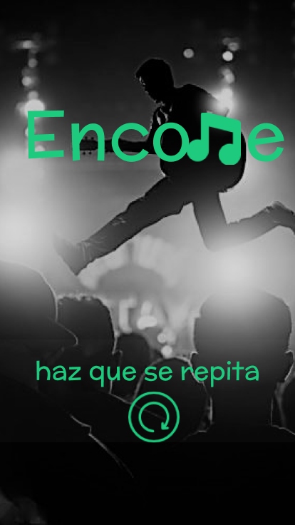

  

Encore es una aplicación en donde músicos y empresas que requieran de sus servicio se pueden comunicar y negociar de una manera sencilla, simple y eficaz para que ambos puedan incrementar sus ingresos. No solo eso! En caso que un usuario no-empresario deseara obtener músico(s) para un evento especial, esta es la plataforma!

## Research Cuantitativo

En Perú no es un misterio que la taza de empleabilidad para los musicos no es muy alta a comparación de otros paises como: EE.UU, Asía, y Europa

## Research Cualitativo

La aplicación se ha realizado para 3 tipos de Usuarios:

- Músicos
- Empresarios 
- Personas no-empresarias

## Affinity Map

A partir de las entrevistas hechas a los músicos y empresas, se ha realizado una lluvia de ideas en el cual mostrare en la siguiente imagen y [enlace](https://realtimeboard.com/app/board/o9J_kzz_Qco=/):

__Los Puntos más resaltantes han sido los siguientes_:

- 
- 

## Canvas de Modelo de Negocio

Esto seria el [canvas de modelo de negocio](https://realtimeboard.com/app/board/o9J_kzz-1Bk=/) tanto como músicos y empresarios, a conclusión de las ideas expuestas en el *affinity map*:

## User Persona

- Conoce a nuestro User persona músico: [Sebastian](https://realtimeboard.com/app/board/o9J_kzz_TDw=/)

- Conoce a nuestro User persona no-empresario: [Jose](https://realtimeboard.com/app/board/o9J_kzzHTsQ=/)

## Story Telling:

La aplicación se creo para 3 tipos de usuarios, pero en esta oportunidad mostraremos la historia de 2, un músico y una persona no-empresario en el cual tienen sueños y metas distintas pero rumbo al mismo camino: La música.

- Para leer la historia de nuestro músico Sebatian, [Click Aquí](https://1drv.ms/w/s!Ajr-tUTQOX2ud1MlJ9UqH9hoSS8)
- Para leer la historia de nuestro Ingeniero de sonido Jose, [Click Aquí](https://1drv.ms/w/s!Ajr-tUTQOX2ugR_ch8nKFlnWGb0O)

## Protipo

### Enlaces Adicionales:

  - *Organización de actividades* [Trello](https://trello.com/b/PArjm92D/encore)
  - *Fotos, Entrevistas y feedbacks* [Google Drive](https://drive.google.com/drive/folders/1W1dorBrei4LPQhPF3GOIec9RGbct-vRM?usp=sharing)
  - *Sketch de prototipo* [Click Aquí](*)

### Elaborado por integrante de BerryPicking:  
  
 - [Franshesca Quezada Monzón](https://github.com/franshescaqm)